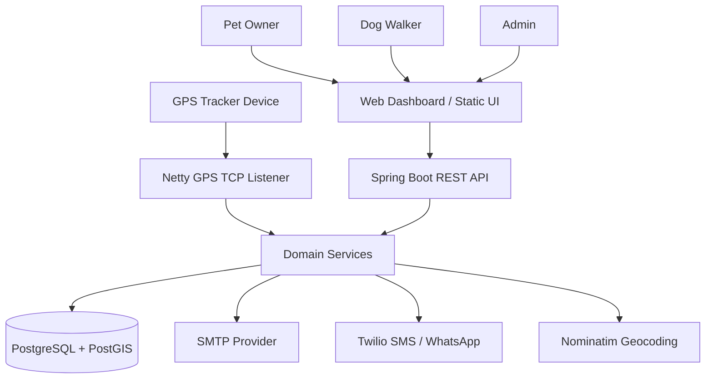
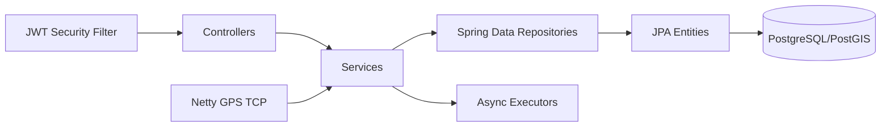
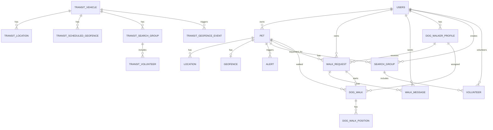
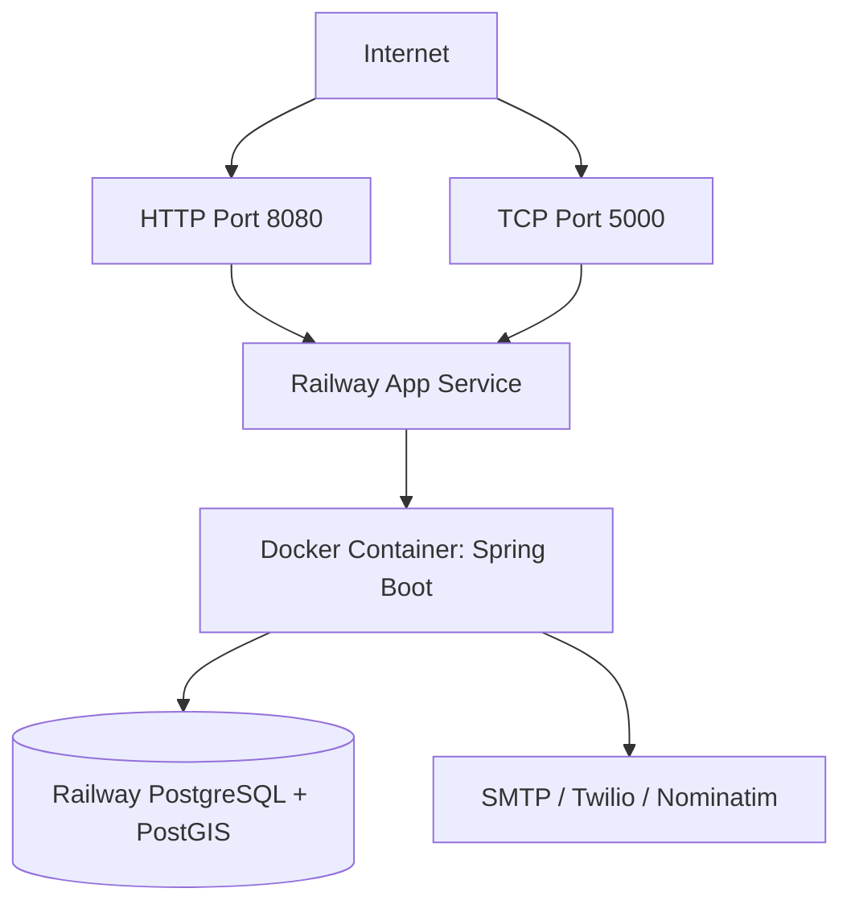
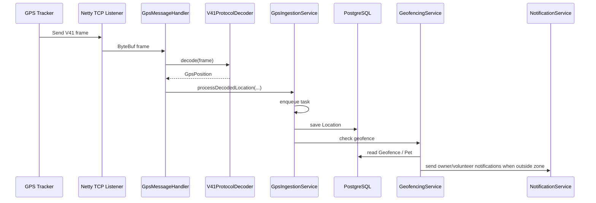
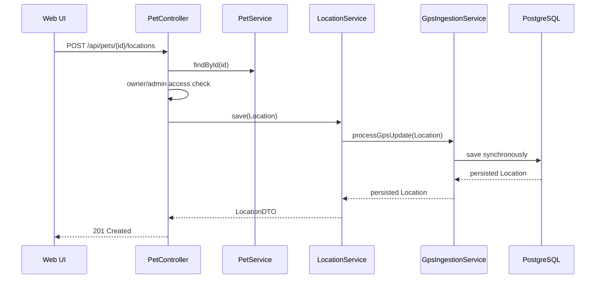
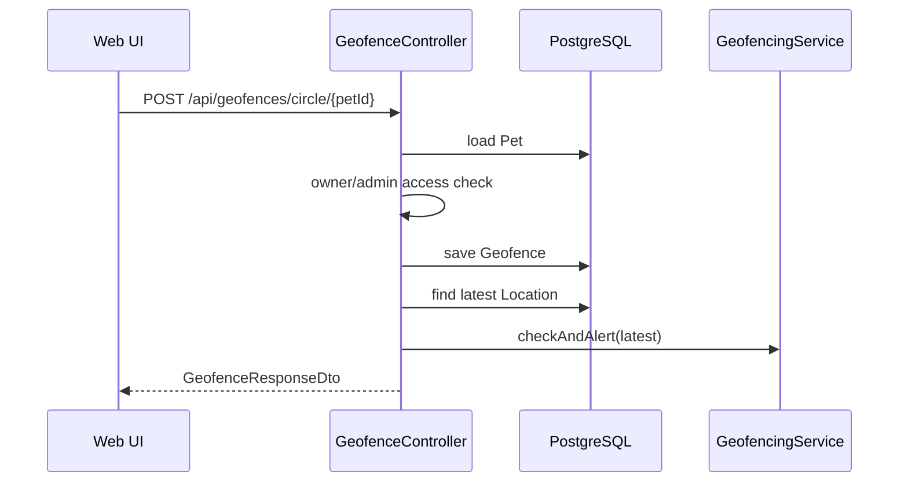
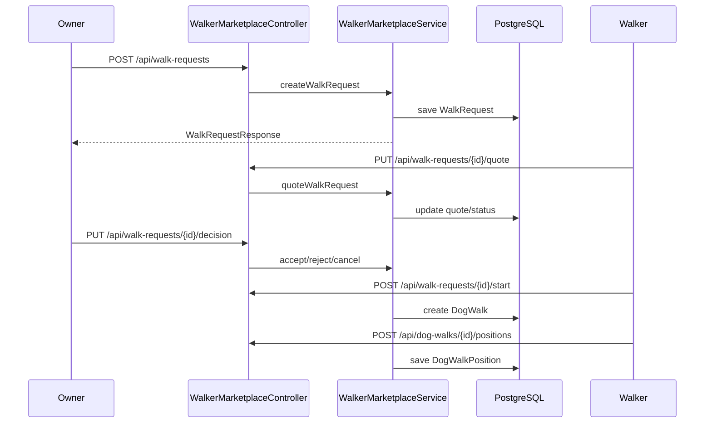
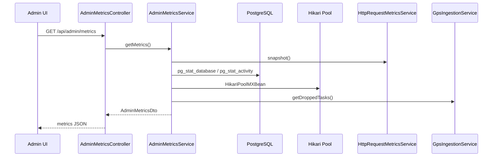
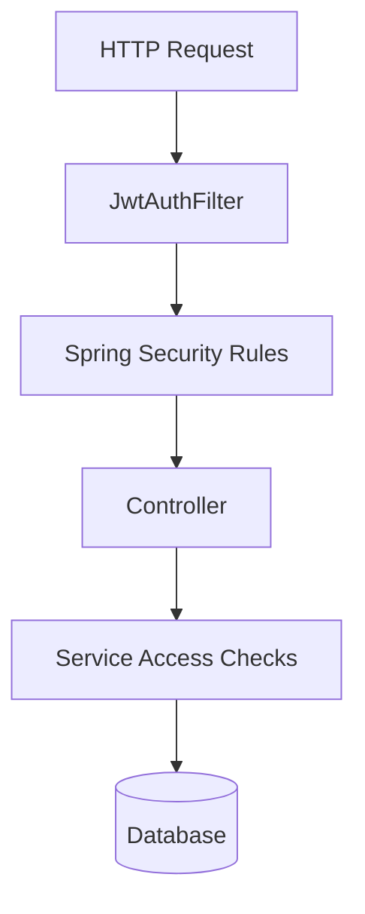

# Firuapp Design Document

## 1. Purpose

Firuapp is a pet tracking, geofencing, lost-pet coordination, and dog-walking marketplace platform. The backend currently lives in the `pettracker` Spring Boot service and serves REST APIs, a static web dashboard, a GPS TCP listener, notifications, geofence processing, marketplace workflows, transit tracking modules, and admin operational metrics.

This document defines the current system design, functional and non-functional requirements, data model, runtime architecture, deployment model, sequence flows, and operational considerations.

## 2. Scope

### In Scope

- Owner account registration and login.
- Pet registration and tracker IMEI binding.
- GPS location ingestion through TCP tracker protocol.
- Manual location posting through REST API.
- Location history, latest location, and route retrieval.
- Geofence creation and boundary checks.
- Alerts and owner/volunteer notifications.
- Lost-pet search groups and volunteer coordination.
- Dog walker marketplace, quote, request, chat, active walk tracking, and completion.
- Admin walker management.
- Admin metrics dashboard for HTTP, DB, Hikari, and GPS ingestion signals.
- Transit tracking module for vehicles, scheduled geofences, search groups, and reports.

### Out of Scope

- Native mobile applications.
- Payment processing.
- Real-time map streaming over WebSocket for all location updates.
- Multi-tenant organization separation.
- Full observability stack with Prometheus/Grafana.
- External identity provider integration.

## 3. Current Technology Stack

- Language: Java 21.
- Framework: Spring Boot 3.3.1.
- Web/API: Spring MVC, embedded Tomcat.
- Security: Spring Security, JWT bearer tokens.
- Persistence: Spring Data JPA, Hibernate.
- Database: PostgreSQL with PostGIS.
- GPS TCP: Netty.
- Async jobs: Spring `ThreadPoolTaskExecutor`.
- Notifications: SMTP email and Twilio SMS/WhatsApp.
- Maps/frontend: Static HTML/CSS/JavaScript with Leaflet.
- Deployment: Docker/Railway.

## 4. Users and Roles

| Role | Description | Main Capabilities |
| --- | --- | --- |
| USER | Pet owner | Manage pets, create walk requests, track pets, configure geofences, manage lost-pet groups |
| WALKER | Dog walker | Receive walk requests, quote, chat, start walks, send positions, complete walks |
| ADMIN | Platform admin | Manage walkers, view metrics, access owner-level resources as needed |

## 5. Functional Requirements

### Authentication

- Users can register with name, email, password, and phone.
- Users can log in with email and password.
- Backend issues JWT tokens.
- Email matching is case-insensitive.
- Protected APIs require a valid bearer token.

### Pet Management

- Owners can create, list, update, and delete pets.
- Admins can manage pets across owners.
- Pets can be bound to a GPS tracker IMEI.
- Pets can have image metadata and image bytes.
- Pets can be marked `ACTIVE` or `LOST`.

### GPS Tracking

- GPS devices connect to TCP port `5000`.
- V41/JT808 frames are decoded by the GPS protocol decoder.
- ASCII bracket GPS frames are partially supported.
- Decoded GPS updates are persisted asynchronously for tracker-originated updates.
- Manual API location updates are persisted synchronously.
- Locations store:
  - latitude
  - longitude
  - timestamp in configured app timezone
  - battery percentage, when available
  - battery voltage, when available
  - pet reference
- The default app timezone is `America/Bogota`.

### Geofencing

- Owners/admins can create circular and polygon geofences.
- Owners/admins can read and delete geofences for accessible pets.
- On location update, the backend checks whether the pet is outside the geofence.
- Out-of-zone events trigger alerts and notifications.

### Lost Pet Search

- Owners can create search groups for lost pets.
- Volunteers can join and leave search groups.
- Search groups expose volunteer lists.
- Volunteers can receive notifications for lost-pet/geofence events.

### Dog Walker Marketplace

- Walkers can apply through a public form.
- Admins can approve, reject, activate, deactivate, create, update, and delete walker profiles.
- Owners can create walk requests to approved walkers.
- Walkers can quote requests.
- Owners can accept, reject, or cancel requests.
- Owners and walkers can exchange request messages.
- Walkers can start accepted/negotiating walks.
- Walkers can post live walk positions.
- Owners and walkers can view active/historical walks.
- Walkers can complete walks.

### Admin Metrics

- Admins can view:
  - total HTTP requests since service start
  - in-flight HTTP requests
  - 4xx and 5xx response counts
  - PostgreSQL committed and rolled-back transactions
  - open DB connections
  - app-owned DB connections
  - active, idle, and idle-in-transaction DB sessions
  - Hikari active, idle, total, max, and waiters
  - GPS ingestion dropped task count

### Transit Module

- Users can create and track transit vehicles.
- Transit locations can be ingested.
- Transit routes and reports can be queried.
- Scheduled geofences can be configured for vehicles.
- Transit search groups and volunteers support incident coordination.

## 6. Non-Functional Requirements

### Performance

- Common list endpoints must support pagination.
- GPS ingestion must not block Netty event loop threads.
- Database hot paths must use indexes.
- JPA list mapping should avoid N+1 queries through entity graphs or projections.
- Location route queries must have bounded result sizes.

### Scalability

- REST API and GPS listener currently run in one service.
- The design should allow future split of GPS ingestion into a separate service.
- Thread pools must be configurable by environment variables.
- Database connection pool size must be configurable.

### Reliability

- GPS ingestion queue overflow must be counted and logged.
- Notification failures should not crash request processing.
- Geofence processing should log failures without losing the persisted location.
- Railway deployment must fail fast if a production JWT secret is missing.

### Security

- JWT is required for protected APIs.
- Admin routes are protected by `ROLE_ADMIN`.
- Geofence APIs must enforce owner/admin access.
- Owner-scoped pet APIs must enforce owner/admin access.
- CORS allowed origins must be explicitly configured.
- Passwords must be hashed using BCrypt.
- JWT secret must not use the local development fallback in production.

### Observability

- Admin metrics endpoint exposes basic app health signals.
- Hikari leak detection is configured.
- GPS dropped tasks are counted.
- PostgreSQL session health is visible through admin metrics.
- Full production observability should later use Micrometer/Actuator/Prometheus.

### Maintainability

- Controllers should remain thin.
- Business logic belongs in services.
- Persistence access belongs in repositories.
- DTOs should isolate API responses from JPA entities.
- Timezone handling should use `AppTimeService`.

## 7. High-Level Architecture

## 8. Backend Logical Architecture

## 9. Core Components

| Component | Responsibility |
| --- | --- |
| `AuthController` | Registration and login |
| `PetController` | Pet CRUD, images, locations, route, lost/found |
| `GeofenceController` | Geofence CRUD with owner/admin access |
| `SearchGroupController` | Lost-pet search group workflows |
| `WalkerMarketplaceController` | Walker marketplace, chats, walks, positions |
| `AdminMetricsController` | Admin system metrics |
| `GpsTcpServer` | TCP listener lifecycle |
| `GpsMessageHandler` | Frame routing and GPS ingestion entrypoint |
| `V41ProtocolDecoder` | V41/JT808 protocol decoding |
| `GpsIngestionService` | Async tracker location persistence |
| `GeofencingService` | Boundary checks and geofence alerts |
| `NotificationService` | Email, SMS, WhatsApp notifications |
| `AdminMetricsService` | DB/Hikari/HTTP/GPS metric aggregation |
| `HttpRequestMetricsService` | In-process HTTP request counters |

## 10. Data Model

### Entity Relationship Diagram

### Main Entities

| Entity | Purpose |
| --- | --- |
| `User` | Account identity, auth role, contact data |
| `Pet` | Owner pet profile and tracker IMEI binding |
| `Location` | GPS/manual pet position with timestamp and battery metadata |
| `Geofence` | Circular or polygonal boundary per pet |
| `Alert` | Boundary/lost/manual alert record |
| `SearchGroup` | Lost-pet community search group |
| `Volunteer` | User participation in a search group |
| `DogWalkerProfile` | Walker marketplace profile |
| `WalkRequest` | Owner request to a walker |
| `WalkMessage` | Chat message on a walk request |
| `DogWalk` | Active or completed walk derived from request |
| `DogWalkPosition` | Live position updates during dog walk |
| `TransitVehicle` | Tracked vehicle in transit module |
| `TransitLocation` | Vehicle location point |
| `TransitScheduledGeofence` | Time-based vehicle zone rule |
| `TransitGeofenceEvent` | Transit geofence violation event |
| `TransitSearchGroup` | Transit incident search group |
| `TransitVolunteer` | Transit volunteer membership |

## 11. Deployment Architecture

### Required Deployment Variables

| Variable | Required | Purpose |
| --- | --- | --- |
| `JWT_SECRET` | Yes | JWT signing key |
| `DATABASE_URL` or Railway DB vars | Yes | PostgreSQL connection |
| `APP_CORS_ALLOWED_ORIGINS` | Recommended | Browser CORS allowlist |
| `APP_TIME_ZONE` | Optional | Defaults to `America/Bogota` |
| `SPRING_DATASOURCE_HIKARI_MAXIMUM_POOL_SIZE` | Optional | DB pool max size |
| `GPS_INGESTION_CORE_THREADS` | Optional | GPS executor core threads |
| `GPS_INGESTION_MAX_THREADS` | Optional | GPS executor max threads |
| `GPS_INGESTION_QUEUE_CAPACITY` | Optional | GPS executor queue capacity |
| `TWILIO_*` | Optional | SMS/WhatsApp notifications |
| `SPRING_MAIL_*` | Optional | Email notifications |
| `JDBC_WATCHDOG_ENABLED` | Temporary only | Kill stale idle DB transactions if explicitly enabled |

## 12. Runtime Threading Model

| Thread Pool | Purpose | Notes |
| --- | --- | --- |
| Tomcat request threads | REST API traffic | Configurable max/min spare |
| Netty event loops | GPS TCP frame handling | Must not block on DB work |
| `gpsExecutor` | Async tracker GPS persistence | Queue has bounded capacity and drop counter |
| `geofenceExecutor` | Async geofence checks | Used for volunteer notification path |
| `notificationExecutor` | Email/SMS/WhatsApp async work | Isolates slow providers |
| `alertExecutor` | Alert-related async tasks | Separate from HTTP request threads |

## 13. Key Sequence Diagrams

### 13.1 GPS Location Ingestion

### 13.2 Manual Location Update

### 13.3 Geofence Creation and Immediate Check

### 13.4 Dog Walker Request Flow

### 13.5 Admin Metrics Dashboard

## 14. API Surface Summary

### Public

- `POST /api/auth/register`
- `POST /api/auth/login`
- `GET /api/public/walkers`
- `POST /api/walker-applications`

### Authenticated Owner/Walker/Admin

- `GET /api/me`
- `GET /api/pets`
- `POST /api/pets`
- `GET /api/pets/{id}`
- `PUT /api/pets/{id}`
- `DELETE /api/pets/{id}`
- `POST /api/pets/{id}/locations`
- `GET /api/pets/{id}/locations`
- `GET /api/pets/{id}/route`
- `POST /api/geofences/circle/{petId}`
- `POST /api/geofences/polygon/{petId}`
- `GET /api/geofences/{petId}`
- `DELETE /api/geofences/{petId}`
- `POST /api/search-groups`
- `GET /api/search-groups`
- `POST /api/search-groups/{id}/join`
- `POST /api/search-groups/{id}/leave`
- `POST /api/walk-requests`
- `GET /api/walk-requests`
- `GET /api/walk-requests/{id}`
- `GET /api/walk-requests/{id}/messages`
- `POST /api/walk-requests/{id}/messages`
- `POST /api/walk-requests/{id}/start`
- `GET /api/dog-walks`
- `POST /api/dog-walks/{id}/positions`

### Admin

- `GET /api/admin/walkers`
- `POST /api/admin/walkers`
- `PUT /api/admin/walkers/{id}`
- `DELETE /api/admin/walkers/{id}`
- `GET /api/admin/metrics`

## 15. Security Model

### Authorization Rules

- `/api/auth/**`, `/api/public/**`, `/api/walker-applications`, static assets, and `/ws/**` are public.
- `/api/admin/**` requires `ROLE_ADMIN`.
- All other API routes require authentication.
- Owner-scoped resources must validate owner/admin access in service/controller logic.

## 16. Database Optimization Design

### Existing Optimization Direction

- Index high-cardinality and time-ordered access patterns:
  - `location(pet_id, timestamp DESC)`
  - `pet(owner_id)`
  - `pet(imei)`
  - `walk_requests(owner_id, created_at DESC)`
  - `walk_messages(walk_request_id, created_at ASC)`
  - `dog_walk_positions(dog_walk_id, recorded_at DESC)`
- Use entity graphs to avoid N+1 fetches in list endpoints.
- Use pagination for list endpoints.
- Limit route history returned to the client.
- Enable Hibernate batch fetch and JDBC batching.

### Future DB Improvements

- Replace large entity reads with DTO projections for high-volume endpoints.
- Partition `location` by time or pet for large-scale GPS history.
- Add retention policy for old high-frequency location points.
- Store raw GPS frame samples for protocol debugging if needed.
- Consider `TIMESTAMPTZ` instead of `LocalDateTime` for canonical timestamp storage.

## 17. Operational Metrics

| Metric | Source | Meaning |
| --- | --- | --- |
| `http.totalRequests` | App filter | Requests handled since start |
| `http.inFlightRequests` | App filter | Currently active requests |
| `http.clientErrorResponses` | App filter | 4xx responses since start |
| `http.serverErrorResponses` | App filter | 5xx responses since start |
| `database.committedTransactions` | `pg_stat_database` | Committed DB transactions |
| `database.rolledBackTransactions` | `pg_stat_database` | Rolled-back DB transactions |
| `database.openConnections` | `pg_stat_activity` | Open sessions for current DB |
| `database.idleInTransactionConnections` | `pg_stat_activity` | Sessions holding open idle transactions |
| `pool.activeConnections` | Hikari MXBean | Currently borrowed connections |
| `pool.threadsAwaitingConnection` | Hikari MXBean | Threads waiting for DB connection |
| `gps.droppedTasks` | GPS ingestion service | GPS tasks rejected due to full queue |

## 18. Failure Modes and Mitigations

| Failure | Impact | Current Mitigation | Future Mitigation |
| --- | --- | --- | --- |
| DB pool exhausted | API latency/errors | Hikari metrics, pool config | Alerts on pool waiters |
| GPS burst overload | Dropped GPS updates | Bounded queue, drop counter | Kafka/queue-based ingestion |
| Long idle DB transactions | Locks/vacuum issues | Optional temporary watchdog | DB-native timeout |
| Notification provider slow | Slow alerts | Async notification executor | Retry queue/dead letter |
| Geocoding provider slow | Slow neighborhood lookups | Configurable provider | Cache geocoding results |
| Invalid tracker timestamp timezone | Wrong persisted time | Configured app timezone parser | Store raw tracker time and canonical UTC |

## 19. Key Design Decisions

| Decision | Rationale |
| --- | --- |
| Single Spring Boot service for API + GPS | Simpler deployment and faster iteration |
| PostgreSQL + PostGIS | Supports relational data and polygon geofences |
| JWT stateless auth | Simple API authentication for static frontend |
| Async tracker ingestion | Keeps TCP handling responsive |
| Hikari pool metrics | Visibility into connection usage |
| App timezone service | Centralizes Colombia/local time handling |
| Optional JDBC watchdog | Temporary emergency tool, disabled by default |

## 20. Open Questions

- Does the physical GPS tracker send timestamps in UTC or local device time for every message type?
- Should location timestamps be migrated to `TIMESTAMPTZ` for canonical storage?
- Should GPS ingestion become a separate worker service?
- Should map updates move to WebSocket/SSE instead of polling?
- What is the desired retention policy for high-frequency GPS points?
- Do admins need historical metrics, or are current in-memory counters sufficient?
- Should payment and ratings be added to the walker marketplace?

## 21. Recommended Roadmap

### Short Term

- Add integration tests using Testcontainers PostgreSQL/PostGIS.
- Add role/access tests for geofence, pet, walk, and search group APIs.
- Add pagination metadata wrappers for list endpoints.
- Add frontend admin metric refresh interval.
- Confirm tracker timestamp semantics with real frame samples.

### Medium Term

- Add Spring Boot Actuator and Micrometer.
- Export metrics to Prometheus/Grafana or Railway observability.
- Add DB-native `idle_in_transaction_session_timeout`.
- Add DTO projections for large list endpoints.
- Add location retention/downsampling policy.

### Long Term

- Split GPS ingestion into a separate service.
- Add durable event queue for GPS and notification processing.
- Add mobile app or PWA.
- Add payments, walker ratings, and dispute handling.
- Add multi-region or high availability deployment model.
